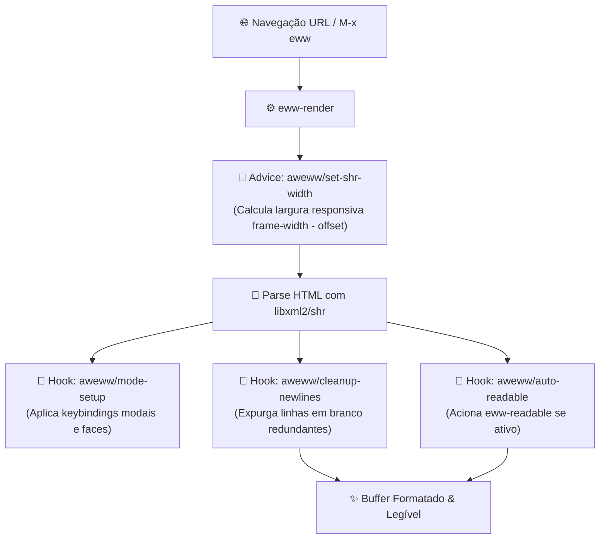

# 🌐 Aweww — Awesome EWW

> Extensão moderna, tipográfica e ergonômica para o navegador embutido Emacs Web Wowser (EWW), transformando o GNU Emacs em uma estação de leitura imersiva e sem distrações.

[](https://github.com/GabrielFrigo4/environment)
[](https://www.gnu.org/software/emacs/)
[](https://www.gnu.org/software/emacs/manual/html_node/eww/index.html)
[](aweww.el)
[](LICENSE)

---

## 🧭 Visão Geral

O **`aweww`** (Awesome EWW) eleva a experiência nativa do navegador `eww` do GNU Emacs. Em vez de páginas esticadas ou com quebras de linha irregulares, o Aweww calcula margens dinâmicas baseadas na largura da janela (`frame-width`), integra renderização tipográfica no estilo Org-mode via `shrface`, realça blocos de código com syntax highlighting e fornece atalhos de tecla única no estilo modal (`R`, `I`, `C`).

---

## 🔄 Fluxo de Renderização & Interceptação



---

## ✨ Funcionalidades em Destaque

| Recurso                           | Descrição                                                                            |
| :-------------------------------- | :----------------------------------------------------------------------------------- |
| **Largura Responsiva Dinâmica**   | O conteúdo se adapta automaticamente à largura do frame via `shr-width` dinâmico.    |
| **Leitura Imersiva (Readable)**   | Ativação automática ou manual com um único toque na tecla `R`.                       |
| **Controle Instantâneo de Mídia** | Alterne renderização de imagens (`I`) ou cores CSS (`C`) para economia de recursos.  |
| **Higienização de Espaçamento**   | Remove quebras de linha duplas e espaços órfãos pós-renderização.                    |
| **Sintaxe em Blocos de Código**   | Integração pronta com `shr-tag-pre-highlight` para realce de trechos `<pre>`.        |
| **Tipografia Org-Mode**           | Suporte transparente a `shrface` para cabeçalhos e títulos visualmente estruturados. |

---

## ⌨️ Mapa de Teclas & Comandos Modais

Ao navegar no buffer `*eww*`, as teclas rápidas operam diretamente sem prefixos complexos:

|  Tecla  | Comando                 | Ação                                                   |
| :-----: | :---------------------- | :----------------------------------------------------- |
| **`R`** | `aweww/toggle-readable` | Alterna modo de leitura sem distrações (_Reader View_) |
| **`I`** | `aweww/toggle-images`   | Liga/Desliga exibição de imagens na página             |
| **`C`** | `aweww/toggle-colors`   | Liga/Desliga cores e estilos CSS originais             |
| **`H`** | `eww-list-histories`    | Exibe histórico navegacional                           |
| **`B`** | `eww-back-url`          | Retorna à página anterior                              |
| **`F`** | `eww-forward-url`       | Avança à página seguinte                               |
| **`q`** | `quit-window`           | Fecha a janela do navegador graciosamente              |

---

## 🚀 Instalação

### Modo Local / Git Submodule (Recomendado no Ecossistema)

Se você utiliza o **Universal Environment** ou o **GNU Emacs Hub**:

```sh
# Dentro do diretório ~/.emacs.d/usr/local/
git submodule add https://github.com/GabrielFrigo4/aweww.git usr/local/aweww
```

No seu `init.el`:

```elisp
(add-to-list 'load-path (expand-file-name "usr/local/aweww" user-emacs-directory))
(require 'aweww)
```

---

### Via Elpaca

```elisp
(use-package aweww
  :ensure (:type git :host github :repo "GabrielFrigo4/aweww"))
```

---

### Via Quelpa

```elisp
(use-package aweww
  :quelpa (aweww :fetcher github :repo "GabrielFrigo4/aweww"))
```

---

## ⚙️ Configuração Personalizada

O `aweww` possui variáveis declarativas customizáveis:

```elisp
(use-package eww
  :ensure nil
  :config
  (when (locate-library "aweww")
    (require 'aweww)
    ;; Ativa modo readable automaticamente em todas as paginas
    (setq aweww/auto-readable t)
    ;; Define a margem dinâmica das bordas do frame (padrao: 8 colunas)
    (setq aweww/default-width-offset 8)))
```

---

## 📦 Dependências Opcionais Recomendadas

Para máxima fidelidade visual, recomenda-se ter instalado:

- [`shrface`](https://github.com/chenyanming/shrface) — Tipografia estruturada com visual de cabeçalhos no padrão Org-mode.
- [`shr-tag-pre-highlight`](https://github.com/xuchunyang/shr-tag-pre-highlight) — Syntax highlighting automático em blocos de código.

---

## 📄 Licença & Créditos

- **Autor & Mantenedor:** [Gabriel Frigo](https://github.com/GabrielFrigo4)
- **Licença:** MIT License — Consulte o arquivo [LICENSE](LICENSE) para detalhes completos.
